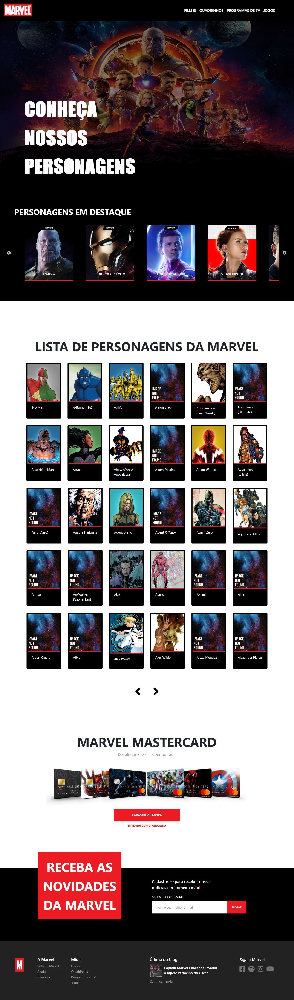

<!-- Título -->
<h1 align="center"><strong>Teste - SBTUR (Viajar Faz Bem)</strong></h1>


<!-- Tópicos -->
<h1>🏁 Tópicos</h1>
<ul>
    <li><a href="#sobre">Sobre o Projeto</a></li>
    <li><a href="#funcionalidades">Funcionalidades</a></li>
    <li><a href="#layout">Layout</a></li>
    <li><a href="#preRequisitos">Pré-requisitos</a></li>
    <li><a href="#tecUtilizadas">Tecnologias Utilizadas</a></li>
    <li><a href="#autor">Autor</a></li>
</ul>


<hr/>
<!-- Sobre o projeto -->
<h2 id="sobre">💻 Sobre o Projeto</h2>
<p align="justify">Layout desenvolvido no Teste da SBTUR (Viajar Faz Bem), utilizando a Api oficial da Marvel.<p>

* [Protótipo](https://xd.adobe.com/spec/f6a84bef-95b8-4c0e-5126-ebac4f9aa822-8099/grid/)
* [Api oficial da Marvel](https://developer.marvel.com/)

<hr/>
<!-- Funcionalidades -->
<h2 id="funcionalidades">⚙️ Funcionalidades</h2>

### Sessões:
- [x] Header
- [x] Capa
- [x] Personagens em Destaque
- [x] Lista de Personagens da Marvel
- [ ] Marvel Mastercard
- [x] Novidades
- [x] Footer


<hr/>
<!-- Layout -->
<h2 id="layout">🎨 Layout</h2>

Para acessar a aplicação, clique [aqui](https://phewrys-sbtur.herokuapp.com/).

<h1 align="center">
  
</h1>


<hr/>
<!-- Pré-requisitos -->
<h2 id="preRequisitos">👉 Pré-requisitos</h2>

Antes de começar, você vai precisar ter instalado em sua máquina as seguintes ferramentas:
* Git
* Node
* Yarn

Siga os passos seguintes para executar a aplicação.

```bash
# Passo 1: Clone este repositório.
$ git clone https://github.com/Phewrys/sbtur.git

# Passo 2: Entre na pasta sbtur.
$ cd sbtur

# Passo 3: Instale os pacotes utilizando o Yarn.
$ yarn

# Passo 4: Execute a aplicação.
$ yarn start

# Pronto, a aplicação será aberta no navegador com o endereço http://localhost:3000.
```


<hr/>
<!-- Tecnologias Utilizadas -->
<h2 id="tecUtilizadas">🛠 Tecnologias Utilizadas</h2>

As seguintes ferramentas foram usadas na construção do Layout:
* React
* Typescript
* HTML
* CSS
* Bootstrap
* Javascript
* Axios
* Styled-components
* Font Awesome
* React-slick
* Slick-carousel
* Yarn
* VS Code

<hr/>
<!-- Autor -->
<h2 id="autor">🦸 Autor</h2>


**TIAGO ALVES DE FARIAS** @phewrys

* **E-mail:** [tiago.farias@dcomp.ufs.br](tiago.farias@dcomp.ufs.br)

* **Portfólio:** [https://phewrys.github.io](https://phewrys.github.io)

* **LinkedIn:** [www.linkedin.com/in/phewrys](www.linkedin.com/in/phewrys)

* **Lattes:** [http://lattes.cnpq.br/5858808633896823](http://lattes.cnpq.br/5858808633896823)
